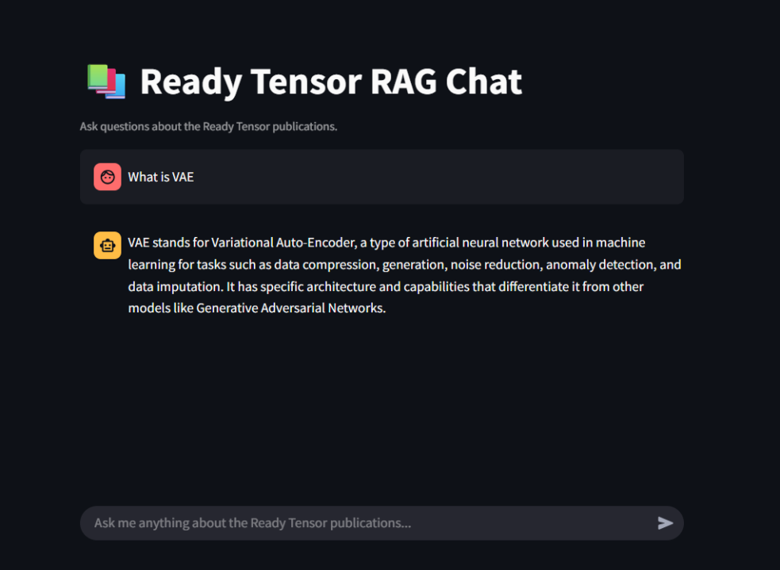

# RAG Pipeline
This repository is part of the **Agentic AI Developer Certification program** by the [Ready Tensor](https://www.readytensor.ai)
and it is linked to the **publication "Agentic AI Developer Certification: RAG-based AI assistant for Exploring Ready Tensor Publications"** on [Ready Tensor](https://www.readytensor.ai)

## Project Description
This repository provides a simple, extensible Retrieval-Augmented Generation (RAG) pipeline using LangChain and Chroma. It includes a generic `DocumentLoader` class that supports JSON and PDF inputs, handles JQ extraction for JSON, and performs text splitting, embedding, and similarity search.

## Features
* **DocumentLoader**: Unified loader for `.json` and `.pdf` files.
* **JSON extraction**: Built-in JQ filtering to extract specific fields (e.g., title, description).
* **Text normalization**: Converts dict-based content into strings before splitting.
* **Text splitting**: Uses `CharacterTextSplitter` to chunk large documents.
* **Embedding & Vectorstore**: Integrates with `OpenAIEmbeddings` and Chroma for storage and retrieval.
* **Similarity Search**: Example querying for semantic search over your documents.

## Repository Structure
```
rag_apk/
├── app/                            
│   └── main.py         # Core llm & vector db implementation
│   └── path.py         # File path configurations
├── loaders/                        
│   └── document_loader.py  # Core DocumentLoader implementation
├── agents/                      
│   └── agent.py        # ????
├── data/                         
│   └── project_1_publications.json    # Sample publications 
├── .env.example         # Environment variables template
├── .gitignore
├── requirements.txt     # Python dependencies
├── README.md
├── LICENSE
├── usage_example.png    # Screenshot_example_usage

```
## Prerequisites
* Python 3.10+
* A valid OpenAI API key (set in environment variable `OPENAI_API_KEY`)

## Installation
1. Clone the repo and be sure you're on the `main` branch:

   ```bash
   git clone https://github.com/Joshua-Abok/rag_apk
   cd rag_apk
   ```
   
## How to Run Locally
1. **Install dependencies**  
   Install required packages (preferably in a virtual environment):

   ```bash
   pip install -r requirements.txt
   ```

2. **Set up environment variables**  
   Create a .env file in the project root with your API keys (e.g., for OpenAI).

    ```bash
   python3 -m venv .venv
   source .venv/bin/activate       # Linux / macOS
   .\.venv\Scripts\activate      # Windows
   ```
3. **Add your OpenAI API key to a `.env` file at the project root**:

   ```env
   OPENAI_API_KEY=your_openai_api_key_here
   ```
4. **Prepare data**  
   Ensure the file `project_1_publications.json` is present in the `DATA_DIR` directory.

5. **Run the app**  
   From the project root, start Streamlit:

   ```
   streamlit run app/main.py
   ```

6. **Open in browser**  
   Streamlit will provide a local URL (usually http://localhost:8501). Open it in your browser.

You can now interact with the Ready Tensor Publication Explorer!


# Usage Examples 


## License
This project is licensed under the MIT License - see the [LICENSE](LICENSE.txt) file for details.
