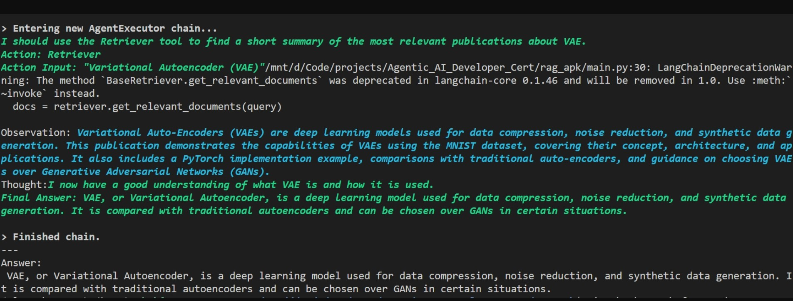

# RAG Pipeline
This repository is part of the **Agentic AI Developer Certification program** by the [Ready Tensor](https://www.readytensor.ai)
and it is linked to the **publication "Agentic AI Developer Certification: Course Project: A RAG-powered AI assistant for a Tensor Publication Explorer"** on [Ready Tensor](https://www.readytensor.ai)

## Project Description
This repository provides a simple, extensible Retrieval-Augmented Generation (RAG) pipeline using LangChain and Chroma. It includes a generic `DocumentLoader` class that supports JSON and PDF inputs, handles JQ extraction for JSON, and performs text splitting, embedding, and similarity search.

## Features
* **DocumentLoader**: Unified loader for `.json` and `.pdf` files.
* **JSON extraction**: Built-in JQ filtering to extract specific fields (e.g., title, description).
* **Text normalization**: Converts dict-based content into strings before splitting.
* **Text splitting**: Uses `CharacterTextSplitter` to chunk large documents.
* **Embedding & Vectorstore**: Integrates with `OpenAIEmbeddings` and Chroma for storage and retrieval.
* **Similarity Search**: Example querying for semantic search over your documents.

## Repository Structure
```
rag_apk/
├── app/                            
│   └── main.py
│   └── path.py 
├── loaders/                        
│   └── document_loader.py
├── agents/                      
│   └── agent.py
├── data/                         
│   └── project_1_publications.json
├── embeddings/                     
│   └── doc_emb/
├── .env
├── requirements.txt
├── README.md

```
## Prerequisites
* Python 3.10+
* A valid OpenAI API key (set in environment variable `OPENAI_API_KEY`)

## Installation
1. Clone the repo and switch to the `dev` branch:

   ```bash
   git clone https://github.com/<your-org>/<your-repo>.git
   cd <your-repo>
   git checkout dev
   ```
2. Create and activate a virtual environment:

   ```bash
   python3 -m venv .venv
   source .venv/bin/activate       # Linux / macOS
   .\.venv\Scripts\activate      # Windows
   ```
3. Install dependencies:

   ```bash
   pip install -r requirements.txt
   ```
4. Add your OpenAI API key to a `.env` file at the project root:

   ```env
   OPENAI_API_KEY=your_openai_api_key_here
   ```
# Usage Examples 


## License
This project is licensed under the MIT License - see the [LICENSE](LICENSE.txt) file for details.
